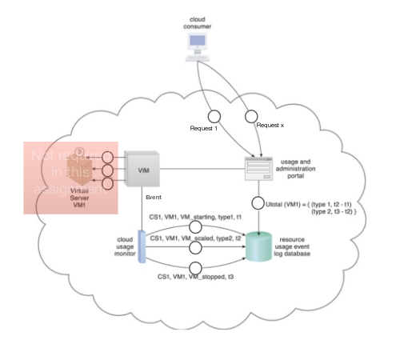

# SE4455 Assignment 2: Resource Usage Agent
#### Due Date: March 6, 2019

## Installation Notes
Read the `README` in the [server](server/README.md) and [usage](usage/README.md) directories.

## Instructions
In this assignment you are going to implement the cloud  usage monitor as explained in Unit 4. In order to develop this agent you should consider other important roles needed by the cloud  usage monitor to fulfill its job as shown in the figure below :

## Requirements
1. login using user name and password.
2. Request creating new VM with certain configuration template.
3. Request to start VM.
4. Request to stop VM.
5. Request to delete VM.
6. Request to upgrade VM to the next configuration template.
7. Request to downgrade VM to the previous configuration template.
8. Request usage per VM for start and end time stamp.
9. Request total charges for the usage of  all owned VMs for start and end time stamp.

## VIM
The VIM responses to the user requests and creates events to the cloud usage monitor.
In this assignment you will not implement  the virtual server management part as shown in the figure above , so your VIM implementation will focus only on creating events to the cloud usage monitor.
The VIM events should include the following:

1. VM id ( virtual machine identifier )
2. CC id  ( cloud consumer identifier )
3. VM Type ( virtual machine  current configuration , please see VM configuration Template section below )
4. Event type { create ,start, stop, delete, upgrade, downgrade}, this will define the type of  user request
5.

Event time stampThe VIM should be a web service that receives requests from the user portal and generates events to the cloud  usage monitor  

## Cloud Usage Monitor
This agent will response to the VIM events and store  them in the data store. In other words , It should be an event driven web service that stores  events in the data store.

## VM Configuration Template
There are three configuration templates for the virtual server, each has a usage charge per minute:

1. Basic  Virtual Server Instance  -  8 virtual processor cores, 16 GB of virtual RAM, 20 GB of storage space in the root file system - 5 cents/minute
2. Large Virtual Server Instance -  32 virtual processor cores, 64 GB of virtual RAM, 20 GB of storage space in the root file system -10 cents/minute
3. Ultra-Large Virtual Server Instance-128 virtual processor cores, 512 GB of virtual RAM, 40 GB of storage space in the root file system- 15 cents /minute

## Usage Cycle
Virtual servers can be started, scaled, and stopped multiple times during the measurement period. The time interval between each occurrence i (i = 1, 2, 3,...) of these pairs of successive events that are declared for a virtual server is called a usage cycle that is known as Tcycle[i]:
- VM_Starting, VM_Stopping
- VM_Starting, VM_Scaled
- VM_Scaled, VM_Scaled
- VM_Scaled, VM_Stopping

## Start and End Timestamp
Usage measurements are recorded for a measurement period whose length is defined by two timestamps called Tstart and Tend.

## Total Usage
The total usage per consumer’s virtual machine will be calculate as following

VM Usage = Sum of Tcycle[i] from i=Tstart to i=Tend

## Data Storage
Use any interface ( Relational or noSQL ) to implement a data model that can capture the VIM events and enable virtual machines usage and charges calculations.

## Important Notes
- You can use any platform such as (python , nodejs,..) to develop the cloud services.
- It is recommended to use any cloud providers such as “ Heroku” to host your services for lab demo , while using the local host for development and testing.
- To get the mark of the assignment, you and your group should demo the assignment in the lab time  To the TA
